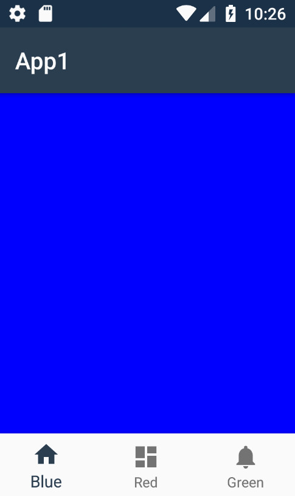

# TabBarController

A view controller for transitioning between fragments via a tab bar in Xamarin.Android.



**The example project used to create this flow is included.**

## Usage

Add TabBarController.cs to your project, call TabBarController.Create(menuResource, fragments) to create an instance, and add it to your SupportFragmentManager or ChildFragmentManager. That's all.

Here's the code behind the above gif:

```cs

using Android.App;
using Android.Graphics;
using Android.OS;
using Android.Support.V7.App;
using Android.Views;
using Controls;
using System.Linq;

namespace App1
{
    [Activity(Label = "@string/app_name", Theme = "@style/AppTheme", MainLauncher = true)]
    public class MainActivity : AppCompatActivity
    {
        private static readonly Color[] colors = new Color[]
        {
            Color.Blue,
            Color.Red,
            Color.Green,
        };

        protected override void OnCreate(Bundle savedInstanceState)
        {
            base.OnCreate(savedInstanceState);
            SetContentView(Resource.Layout.activity_main);

            if (savedInstanceState == null)
            {
                var fragments = Enumerable.Range(0, MainActivity.colors.Length).Select(i => ColorFragment.Create(i));
                var tabBarController = TabBarController.Create(Resource.Menu.colors, fragments);

                this.SupportFragmentManager
                    .BeginTransaction()
                    .Add(Resource.Id.TabControllerContainer, tabBarController)
                    .Commit();
            }
        }

        private class ColorFragment : Android.Support.V4.App.Fragment
        {
            private const string COLOR_INDEX_KEY = "color index";

            public static ColorFragment Create(int colorIndex)
            {
                var args = new Bundle();
                args.PutInt(COLOR_INDEX_KEY, colorIndex);

                var fragment = new ColorFragment();
                fragment.Arguments = args;

                return fragment;
            }

            public override View OnCreateView(LayoutInflater inflater, ViewGroup container, Bundle savedInstanceState)
            {
                var view = new View(this.Activity);
                view.LayoutParameters = new ViewGroup.LayoutParams(
                    ViewGroup.LayoutParams.MatchParent,
                    ViewGroup.LayoutParams.MatchParent
                );

                view.SetBackgroundColor(MainActivity.colors[this.Arguments.GetInt(COLOR_INDEX_KEY)]);
                return view;
            }
        }
    }
}
```